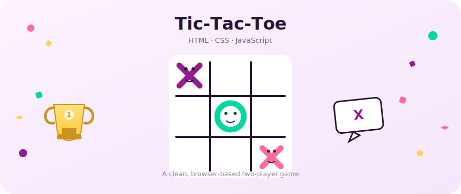

<div align="center">



# 🎮 Tic-Tac-Toe Game

A clean, responsive, two-player Tic-Tac-Toe game built with vanilla **HTML**, **CSS**, and **JavaScript** — no frameworks, no dependencies.


[Live Demo](#-live-demo) · [Features](#-features) · [Getting Started](#-getting-started) · [How It Works](#-how-it-works)

</div>

---

## 📖 Overview

This project is a fully playable Tic-Tac-Toe (Noughts and Crosses) game that runs entirely in the browser. Two players take turns clicking on the grid, the game automatically detects wins and draws, and a popup modal announces the result with sound effects.

It was built as a hands-on exercise in **DOM manipulation**, **event handling**, and **CSS layout**, and is structured so the code is easy to read, extend, and reuse.

## 🚀 Live Demo

You can play the game directly in your browser by opening `index.html`, or deploy it for free with **GitHub Pages**:

1. Push this repo to GitHub
2. Go to **Settings → Pages**
3. Set the source branch to `main` and folder to `/ (root)`
4. Your game will be live at `https://<your-username>.github.io/<repo-name>/`

## ✨ Features

- ✅ Classic 3×3 Tic-Tac-Toe gameplay for two players
- 🔄 Turn indicator that updates in real time (`Turn for X` / `Turn for O`)
- 🏆 Automatic win detection across all 8 possible winning combinations
- 🤝 Draw detection when the board fills up with no winner
- 🎉 Popup modal announcing the winner (or a draw) with a "Play Again" button
- 🔊 Sound effects for moves and game-over events
- 🔁 One-click **Reset** button to restart at any time
- 📱 Responsive layout that scales to different screen sizes
- 🎨 Clean UI styled with the Poppins font and a soft, modern color palette

## 🛠️ Tech Stack

| Technology | Purpose |
|---|---|
| **HTML5** | Page structure & markup |
| **CSS3** | Styling, layout, and animations (native CSS nesting) |
| **JavaScript (ES6)** | Game logic, DOM manipulation, event handling |
| **Google Fonts** | Poppins typeface |

No build tools, frameworks, or external JS libraries are required.

## 📂 Project Structure

```
tic-tac-toe/
├── index.html              # Main HTML structure
├── css/
│   └── style.css           # Styling for the board, modal, and layout
├── js/
│   └── script.js           # Game logic (turns, win/draw detection, reset)
├── assets/
│   ├── images/
│   │   └── banner.svg      # README banner illustration
│   └── sounds/
│       ├── ting.mp3        # Move sound effect
│       └── gameover.mp3    # Win/draw sound effect
├── LICENSE
└── README.md
```

## ⚙️ Getting Started

No installation or build step is required — this is a static site.

### Option 1: Open directly
1. Clone or download this repository
   ```bash
   git clone https://github.com/<your-username>/<repo-name>.git
   ```
2. Open `index.html` in your browser (double-click it, or right-click → Open With → your browser)

### Option 2: Run with a local server (recommended for sound playback)
Some browsers restrict audio/file access when opening HTML files directly. Using a simple local server avoids that:

```bash
# Using Python 3
python3 -m http.server 8000

# Then visit
http://localhost:8000
```

Or use the **Live Server** extension in VS Code.

## 🕹️ How to Play

1. The game starts with **Player X**
2. Click any empty cell on the grid to place your mark
3. Turns automatically alternate between **X** and **O**
4. The first player to align three marks **horizontally, vertically, or diagonally** wins 🏆
5. If all 9 cells are filled with no winner, the game ends in a **draw**
6. Click **Play Again** in the popup, or the **Reset** button, to start a new round

## 🧠 How It Works

- `script.js` attaches a click listener to each of the 9 board cells
- On each click, the current player's symbol is written into the cell, the turn is switched, and a move sound plays
- `checkWin()` checks the board against all 8 winning line combinations (3 rows, 3 columns, 2 diagonals)
- `checkForDraw()` checks if the board is full with no winner
- When a win or draw is detected, a modal pops up with the result and a "Play Again" button, which calls the same reset logic as the **Reset** button

## 🔮 Possible Enhancements

Ideas for extending this project further:

- [ ] Single-player mode vs. a computer opponent (Minimax algorithm)
- [ ] Scoreboard to track wins across multiple rounds
- [ ] Highlight the winning line on the board
- [ ] Light/dark theme toggle
- [ ] Mobile touch animations

Contributions and pull requests for any of the above are welcome!

## 🤝 Contributing

Contributions are welcome! To contribute:

1. Fork this repository
2. Create a new branch (`git checkout -b feature/your-feature`)
3. Commit your changes (`git commit -m "Add your feature"`)
4. Push to your branch (`git push origin feature/your-feature`)
5. Open a Pull Request

## 📄 License

This project is licensed under the **MIT License** — see the [LICENSE](LICENSE) file for details.

## 👤 Author

**Your Name**
- GitHub: [@your-username](https://github.com/your-username)
- LinkedIn: [your-name](https://linkedin.com/in/your-name)

---

<div align="center">

⭐ If you found this project helpful, consider giving it a star on GitHub!

</div>
